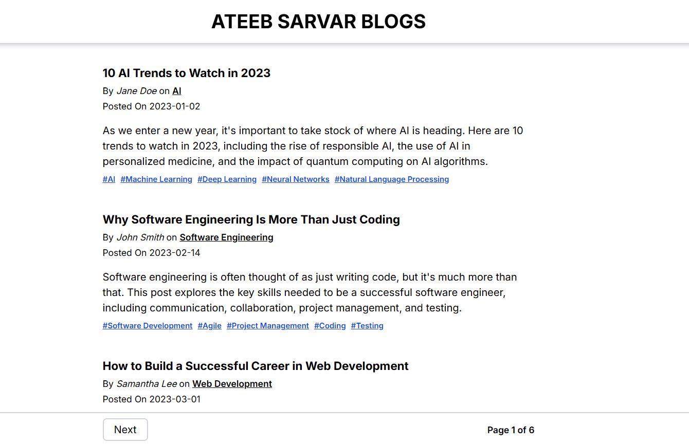

 📝 Blog Listing Website

A responsive blog listing application built with **React** and **Tailwind CSS**. It showcases blog posts with author info, categories, publication dates, tags, and pagination functionality.

## 🚀 Features

- 📚 Blog cards with title, description, author, category, and publish date
- 🔖 Clickable hashtags/tags
- 🔄 Pagination for browsing multiple pages
- 💡 Clean and responsive layout using Tailwind
- ⚛️ Component-based architecture (React)

## 🛠 Tech Stack

- [React](https://reactjs.org/)
- [Tailwind CSS](https://tailwindcss.com/)

## 📂 Project Structure
